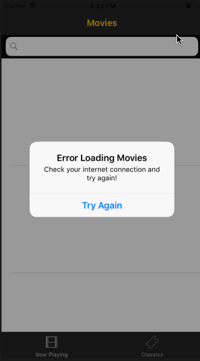
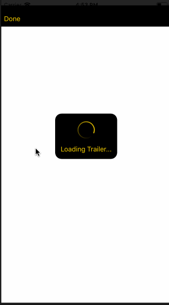

# Project 2 - *Flixster*

**Name of your app** is a movies app using the [The Movie Database API](http://docs.themoviedb.apiary.io/#).

Time spent: **8** hours spent in total

## User Stories

The following **required** functionality is complete:

- [x] User can view a list of movies currently playing in theaters from The Movie Database.
- [x] Poster images are loaded using the UIImageView category in the AFNetworking library.
- [x] User sees a loading state while waiting for the movies API.
- [x] User can pull to refresh the movie list.

The following **optional** features are implemented:

- [x] User sees an error message when there's a networking error.
- [x] Movies are displayed using a CollectionView along with a TableView.
- [x] User can search for a movie.
- [x] All images fade in as they are loading.
- [x] User can view the large movie poster by tapping on a cell.
- [x] For the large poster, load the low resolution image first and then switch to the high resolution image when complete.
- [x] Customize the selection effect of the cell. (CellGrid has alpha fade animation)
- [x] Customize the navigation bar.
- [x] Customize the UI.

The following **additional** features are implemented:

- [x] When loading the small -> large poster, a default image is shown 
- [x] Searchbar has a cancel button that removes text entry and updates table 
- [x] Second Tab has Classics, featuring reccomendations based on old movie
- [x] When clicking on the poster in details, users can watch the first trailer in the database
- [x] Users can return to detail view after trailer with custom Segue
- [x] If no trailers are found, an error is given and users can return to home
- [x] Search includes title and overview, both case insensitive
- [x] Users can see date of release on details view
- [x] Users can see rating system that includes number of ratings from database and a face based on the rating (thresholds are [0,4), [4,6], (6,10])
- [x] Search Bar works for both colleciton view and search view

Please list two areas of the assignment you'd like to **discuss further with your peers** during the next class (examples include better ways to implement something, how to extend your app in certain ways, etc):

1. Different ways one would implement a ratings display system
2. Different ways to allow users to return after Video View

## Video Walkthrough

Here's a walkthrough of the main app functionality

Here's a walkthrough of user stories related to connection issues

Here's a walkthrough of an optional story where if no trailers exist for the movie, the user is able to return home

GIFs created with [LiceCap](http://www.cockos.com/licecap/).

## Notes

Describe any challenges encountered while building the app.

## Credits

List any 3rd party libraries, icons, graphics, or other assets you used in your app.

- [AFNetworking](https://github.com/AFNetworking/AFNetworking) - networking task library
- [SVProgressHUD](https://github.com/SVProgressHUD/SVProgressHUD) - progress HUD

## License

Copyright [2018] [Martin Winton]

Licensed under the Apache License, Version 2.0 (the "License");
you may not use this file except in compliance with the License.
You may obtain a copy of the License at

http://www.apache.org/licenses/LICENSE-2.0

Unless required by applicable law or agreed to in writing, software
distributed under the License is distributed on an "AS IS" BASIS,
WITHOUT WARRANTIES OR CONDITIONS OF ANY KIND, either express or implied.
See the License for the specific language governing permissions and
limitations under the License.
